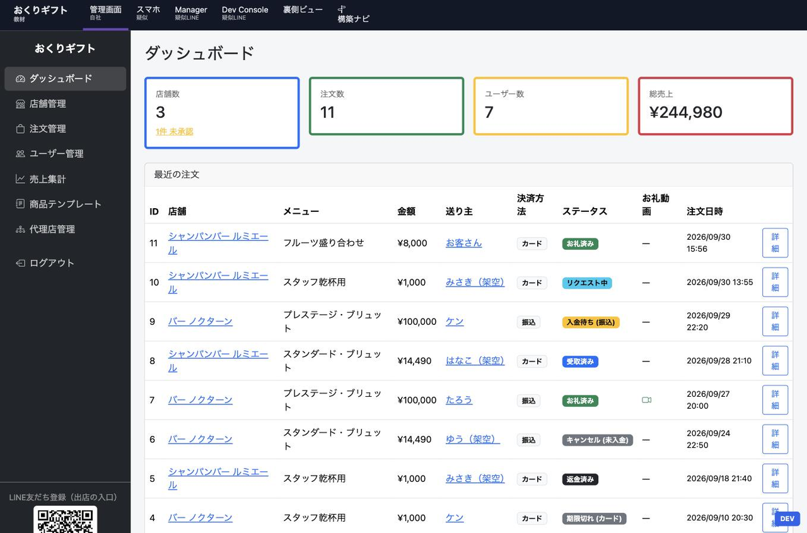
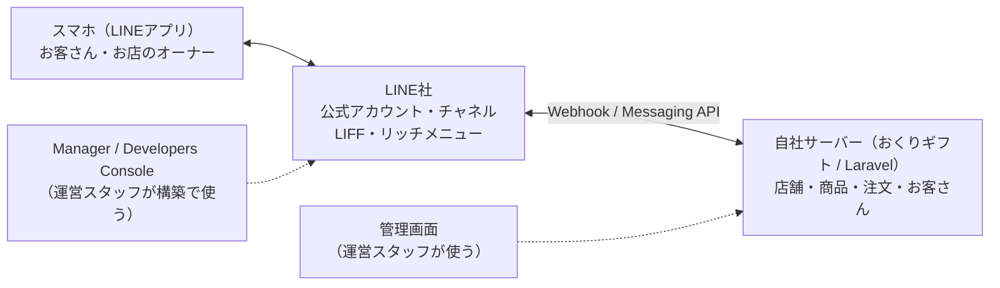

# 公式LINE連携ギフトサービス 体験教材（line-gift-lab）

株式会社SOONESS の「SE・システム開発 仕事体験コース」で使う教材です。**Laravel 12** で作られています。

架空のサービス **「おくりギフト」** は、「LINE でお店にギフト（ドリンクなど）を贈る」サービスです。遠くにいるお客さんが LINE からお店を選んでギフトを贈ると、お店が受け取り、お礼の動画が届きます。

この教材では、次の3つのコースを用意しています。

| コース | 内容 | 目安 |
|---|---|---|
| **A：手順書の「意味」がわかる** | 課題のお店「クラブ アズール」の公式LINEを、手順書の順番どおりに自社サービスへつなぎ、リッチメニューの「ギフトを贈る」から贈れるようにします。**構築ナビ** が次の手順を案内し、1つずつ「裏側で何が起きているか」を見て、わざと壊して、直します | 1日 |
| **B：公式LINEを自分で作れる** | 本物のLINE公式アカウントを作り、あいさつ文・リッチメニューを設定します。できる人は Webhook・API・LIFF まで進みます | 1〜2日 |
| **C：仕組みを読んで直せる** | この教材アプリの Laravel のコードを読み、注文の状態遷移・決済の期限・署名付きURL・暗号化・集計SQL などを理解して、改修課題に取り組みます | 1〜3日 |

**全員がコースA**、進める人が B・C へ進む形です。

| 管理画面 | 疑似スマホ（左：お客さん／右：オーナー） |
|---|---|
|  |  |

---

## 目次

1. [だれが・何をするか](#1-だれが何をするか)
2. [この教材のしくみ](#2-この教材のしくみ)
   - [コースAの課題：クラブ アズールをつなぐ](#コースaの課題クラブ-アズールをつなぐ)
3. [動かし方（Docker）](#3-動かし方docker)
4. [画面とURLの一覧](#4-画面とurlの一覧)
5. [フォルダ構成](#5-フォルダ構成)
6. [よく使うコマンド](#6-よく使うコマンド)
7. [よくあるエラーと対処](#7-よくあるエラーと対処)
8. [使っている技術](#8-使っている技術)

---

## 1. だれが・何をするか

| 人 | すること | 使うもの |
|---|---|---|
| **お客さん** | 運営の公式LINEの「店舗に贈る」か、お店の公式LINE・QRから、商品を選んで**お店にギフトを贈る**。支払いはカード（初回だけ登録）か銀行振込。お店からお礼動画が届く。送信履歴から領収書も出せる | スマホのLINE |
| **お店のオーナー** | 運営の公式LINEから**出店登録**（店舗情報・代表者・振込先・掲載方法）と**商品登録**（テンプレートから選べる）。ギフトが届いたら「受け取る」→ **お礼動画**を送る | スマホのLINE |
| **運営スタッフ（私たち）** | **管理画面**で店舗の承認・手数料（月別も）・代理店・注文・売上の管理。オリジナル（お店の公式LINE）を希望したお店には **LINE の構築**。スマホは動作確認だけ | 管理画面・LINE Manager・Developers Console |

お店の掲載方法は2つあります。

| 掲載方法 | お客さんの入口 | お店の公式LINE |
|---|---|---|
| **共通掲載** | 運営の公式LINE →「店舗に贈る」→ お店を選ぶ | いらない（通知は共通チャネルから） |
| **オリジナル** | お店の公式LINE → リッチメニューの「贈る」／お店のQR | お店がもともと持っているものに、運営が自社サービスをつなぐ |

---

## 2. この教材のしくみ

裏側では、3つのシステムがやりとりしています。



本物の世界では、真ん中の「LINE社」の中は見えません。そこでこの教材では、**LINE社の役をする「疑似LINE」** を自分たちで作り、アプリの中に入れています。インターネットにつながなくても、手順書の全ステップを体験できます。

さらに、3者の間で起きたこと（Webhookが届いた、署名がOKだった、返信をお願いした…）を時間順にすべて表示する **「裏側ビュー」** があります。

| 教材の画面 | 教材の中での使い方 | 本物では |
|---|---|---|
| 管理画面 | 運営スタッフとして操作する | 自社の管理画面 |
| 疑似スマホ | 左：お客さんのスマホ、右：オーナーのスマホ（2台並んでいる） | オーナー・お客さんのスマホ。運営は動作確認で触るだけ |
| 疑似Manager | 運営スタッフとして、お店の公式LINEを設定する（招待URLの発行だけはオーナー役） | LINE Official Account Manager（manager.line.biz） |
| 疑似Dev Console | 運営スタッフとして、チャネル・LIFF・Webhook・トークンを設定する | LINE Developers Console（developers.line.biz） |
| 裏側ビュー | 3者の間で起きたことを見る | （本物にはない。教材だけの特別な窓） |
| 構築ナビ | いまどの手順まで終わったか・次に何をするかを、実際の設定を見て案内する | （本物にはない。手順書の代わりの道案内） |

データベースも3つに分けています。**自社のデータ（`database.sqlite`）と LINE社のデータ（`mockline.sqlite`）は別のもの**で、自社が持っているのは「LINEの設定値のコピー」だけ、という点がこの仕組みを理解するカギです。

### コースAの課題：クラブ アズールをつなぐ

教材には、本番と同じ「スタート地点」のお店が入っています。最初はクラブ アズールで、慣れたら構築ナビのプルダウンで **バー 月あかり**（リッチメニュー3分割・「贈る」は左下）や **焼肉 はるさき**（6分割・「スタッフに贈る」は右下）も選べます。はじめて選んだお店は、お客さんのスマホに公式LINEが追加されます。ほかのお店に切り替えても構築したものは残り、完成したお店はいつでも贈れます。最初からやり直すときは「構築履歴をリセット」を押します。

| もう済んでいること（お店側） | あなた（運営スタッフ）がすること |
|---|---|
| オーナーが運営の公式LINEのQRから **出店登録**（店舗管理一覧に「未承認」、slug は仮の `store-番号`） | 承認して slug を決める |
| お店が **自分の公式LINE** を持っていて、お客さんも友だち追加している | オーナーに招待してもらい、Messaging API を運営のプロバイダーで有効にする |
| — | LINEログインチャネル・LIFF・トークンを用意し、管理画面に5つの値を入れる |
| — | Webhook を登録・検証し、応答設定を整える |
| お店の **リッチメニュー**（ギフトを贈る／お店の情報／営業時間／Instagram） | 「ギフトを贈る」ボタンだけに、贈る画面（LIFF）の URL を入れる |

最後に、お客さんのスマホで「ギフトを贈る」から贈り、オーナーのスマホの「店舗管理」→「贈り物一覧」で受け取れれば完成です。上のメニューの **構築ナビ** を開くと、12の手順のうちどこまで終わったか・次に何をするかが、**実際の設定（疑似LINE・管理画面）を見て自動で** 表示されます。値を間違えると、その手順は「まだ」のままです。

公式LINEやリッチメニューをゼロから作る作業は、覚えることが増えすぎないよう、コースAでは扱いません（第8章の「発展」で流れだけ紹介しています）。

---

## 3. 動かし方（Docker）

### 必要なもの

- **Docker Desktop**（Windows / Mac）：インストールして**起動しておく**（メニューバー／タスクバーにクジラのアイコンが出ていればOK）
- **Git**：ダウンロードに使います（なければ「方法B：zipでダウンロード」でもOK）

### 手順

#### ① ターミナルを開く

| OS | 開き方 |
|---|---|
| Windows | スタートメニューで「PowerShell」と入力して開く |
| Mac | `Command + Space` で Spotlight を開き、「ターミナル」と入力して開く |

#### ② 置き場所のフォルダに移動する（迷ったらデスクトップ）

```bash
cd ~/Desktop
```

> Windows で OneDrive を使っている場合は、デスクトップが `~/OneDrive/Desktop` にあることがあります。

#### ③ 教材をダウンロードする

**方法A：git clone（おすすめ）**

```bash
git clone https://github.com/DevSOONESSorg/line-gift-lab.git
```

**方法B：zipでダウンロード**

1. <https://github.com/DevSOONESSorg/line-gift-lab> の緑色の **「Code」** →「**Download ZIP**」
2. デスクトップに解凍し、フォルダ名が `line-gift-lab-main` なら `line-gift-lab` に変える

#### ④ 起動する

```bash
cd line-gift-lab
docker compose up
```

**初回は3〜5分かかります**（Laravel 本体のダウンロード → データベースの作成 → 初期データの投入）。次の表示が出たら起動完了です。

```
  おくりギフト（教材）を起動しました → http://localhost:3000
  管理画面ログイン: admin@example.com / Taiken-2026
```

ブラウザで <http://localhost:3000> を開き、トップ画面が出れば成功です。

> 起動中は、このターミナルを**閉じないでください**。ほかの作業は新しいターミナルで。

### 止め方

ターミナルで `Ctrl + C` を押したあと、

```bash
docker compose down
```

### 2回目以降

```bash
cd ~/Desktop/line-gift-lab
docker compose up
```

### ポートを変えたいとき（bihin-app などと同時に動かす）

`.env` の `PORT=3000` を `PORT=3001` などに変えて `docker compose up` し直します（`.env` は初回起動時に自動で作られます）。

### コースB：本物のLINEとつなぐとき

本物のLINEからあなたのPCにWebhookを届けるため、**トンネル（インターネットからの入口）** も一緒に起動します。

```bash
docker compose --profile tunnel up
```

---

## 4. 画面とURLの一覧

| 画面 | URL |
|---|---|
| トップ | <http://localhost:3000/> |
| 管理画面（`admin@example.com` / `Taiken-2026`） | <http://localhost:3000/admin> |
| 疑似スマホ | <http://localhost:3000/mock/phone> |
| 疑似Manager | <http://localhost:3000/mock/manager> |
| 疑似Dev Console | <http://localhost:3000/mock/developers> |
| 裏側ビュー | <http://localhost:3000/inside> |
| 構築ナビ | <http://localhost:3000/build> |
| リッチメニュー用テンプレート画像 | <http://localhost:3000/samples/templates/> |

URL と処理の対応は、`routes/web.php` と `routes/api.php` に全部書いてあります。一覧はこのコマンドで見られます。

```bash
docker compose exec app php artisan route:list
```

---

## 5. フォルダ構成

Laravel の標準の形です。★ は、この教材で特に読んでほしいファイルです。

```
line-gift-lab/
├── routes/
│   ├── web.php                 ★ URL と処理の対応表（管理画面・LIFF・疑似LINE）
│   ├── api.php                 ★ Webhook の受け口（/api/webhook/line/...）
│   └── console.php               スケジューラー（期限切れの自動処理）
├── app/
│   ├── Enums/
│   │   ├── OrderStatus.php     ★ 注文の状態と「移ってよい先」（状態遷移）
│   │   └── PaymentMethod.php
│   ├── Models/                   テーブル1つ＝モデル1つ（Store, Order, Customer, Agent …）
│   │   └── Mock/                 疑似LINE側のモデル（別のデータベースを使う）
│   ├── Services/
│   │   ├── BuildGuide.php        構築ナビの手順と「終わったか」の判定
│   │   ├── OrderService.php    ★ 注文を作る・状態を変える（ここ以外で status を書きかえない）
│   │   ├── CommissionService.php 手数料率の決め方（月別 → デフォルト）
│   │   ├── Notifier.php        ★ LINE のお知らせ（店舗チャネル → 共通チャネルへのフォールバック）
│   │   ├── Line/
│   │   │   ├── Signature.php   ★ 署名の計算と確認（HMAC-SHA256）
│   │   │   └── LineClient.php    LINE社へのお願い（返信・送信・トークン確認）
│   │   ├── Bots/StoreBot.php     店舗の公式LINEの返事（コースBで書きかえる）
│   │   └── MockLine/MockLine.php 疑似LINE の中身（Webhook を署名付きで送る）
│   ├── Http/
│   │   ├── Controllers/Admin/    管理画面
│   │   ├── Controllers/Liff/     LINEの中で開く画面（お客さん・オーナー）
│   │   ├── Controllers/Mock/     疑似LINE の画面とAPI
│   │   ├── Controllers/WebhookController.php ★ Webhook を受けて署名を確かめる
│   │   └── Middleware/           「誰が開いたか」「トークンの確認」など
│   └── Console/Commands/         artisan コマンド（期限切れ・障害ドリル・リッチメニュー）
├── resources/views/              画面（Blade）
├── database/
│   ├── migrations/             ★ テーブルの設計図
│   ├── seeders/DatabaseSeeder.php 初期データ
│   ├── database.sqlite           自社のデータ
│   ├── mockline.sqlite           LINE社（疑似）のデータ
│   └── inside.sqlite             裏側ビューの記録
├── config/lab.php                教材の決まりごと（与信の日数、テストカードなど）
├── storage/app/private/          お礼動画・身分証（外から直接は見えない場所）
├── richmenus/                    コースB：リッチメニューの定義（JSON）と画像
├── docker/start.sh               起動時の準備
└── docs/                         コースの手順書
```

---

## 6. よく使うコマンド

アプリを動かしたまま、**別のターミナル**で実行します。

| したいこと | コマンド |
|---|---|
| データを全部消して最初の状態に戻す | `docker compose exec app php artisan migrate:fresh --seed` |
| URL の一覧を見る | `docker compose exec app php artisan route:list` |
| データを直接さわる（対話モード） | `docker compose exec app php artisan tinker` |
| 期限切れの注文をすぐ処理する | `docker compose exec app php artisan orders:expire` |
| 注文の期限を過去にずらす（教材用） | `docker compose exec app php artisan lab:time-travel {注文ID}` |
| 障害ドリル（職員用） | `docker compose exec app php artisan lab:drill` |
| リッチメニューをAPIで作る（コースB） | `docker compose exec app php artisan lab:richmenu list --store=slug` |
| エラーの記録を見る | `storage/logs/laravel.log` を開く |

> **教材を新しい版に更新（git pull）したら**、`migrate:fresh --seed` でデータを作り直してください。

---

## 7. よくあるエラーと対処

| 症状 | 原因と対処 |
|---|---|
| `port is already allocated` | 同じポートを別のアプリが使っている。止めるか、`.env` の `PORT` を変える |
| `Cannot connect to the Docker daemon` | Docker Desktop が起動していない |
| ブラウザで「接続できません」 | まだ起動中（初回は数分）。「起動しました」が出るまで待つ |
| 画面に「エラーが発生しました」 | `storage/logs/laravel.log` の最後を見る。エラーメッセージをAIに貼って聞いてOK |
| 419 Page Expired | 画面を開いたまま時間がたった（CSRFトークンの期限切れ）。再読み込みしてからやり直す |
| 疑似スマホで bot が返事をしない | [裏側ビュー](http://localhost:3000/inside) で NG の行を探す（[困ったとき](docs/course-a/11-drill.md#困ったときの見る場所)）。[構築ナビ](http://localhost:3000/build) で「まだ」の手順がないかも見る |
| 画面がおかしい・構築ナビを最初からやり直したい | `docker compose exec app php artisan migrate:fresh --seed` で見本の状態に戻す |
| コースBで Webhook の「検証」が失敗する | トンネルのURLが変わっていないか確認（起動するたびに変わる） |

---

## 8. 使っている技術

| 役割 | 技術 | ポイント |
|---|---|---|
| 言語・フレームワーク | PHP 8.4 / **Laravel 12** | 本番環境の管理画面と同じ種類の作り |
| 画面 | Blade ＋ **Bootstrap 5.3** ＋ Bootstrap Icons | サーバー側でHTMLを組み立てる方式 |
| データベース | SQLite（3ファイル） | DBサーバーがいらない。接続は `config/database.php` |
| ログイン | Laravel の認証（セッション＋Cookie） | `app/Http/Controllers/Admin/LoginController.php` |
| 定期処理 | Laravel のスケジューラー | `routes/console.php` |
| 実行環境 | Docker Compose ＋ PHP 組み込みサーバー | `docker/start.sh` |
| トンネル（コースB） | Cloudflare Quick Tunnel | アカウント登録なしで https の入口 |

---

## 大事な注意

- 「おくりギフト」「疑似LINE」は体験用の**架空のサービス**です。実在のサービスのURL・ID・パスワードは含まれていません。
- 疑似LINEは、本物のLINEを**わかりやすく単純化**したものです。画面の名前や手順は [LINE Developers のドキュメント](https://developers.line.biz/ja/docs/) に合わせていますが、本物の画面の文言や配置は変わることがあります。
- コースBで使う本物のチャネルシークレット・アクセストークンは、**人に見せない・スクリーンショットに写さない・GitHubに上げない**でください。

## ライセンス

MIT License ／ 株式会社SOONESS（就労継続支援A型）SE仕事体験コース
