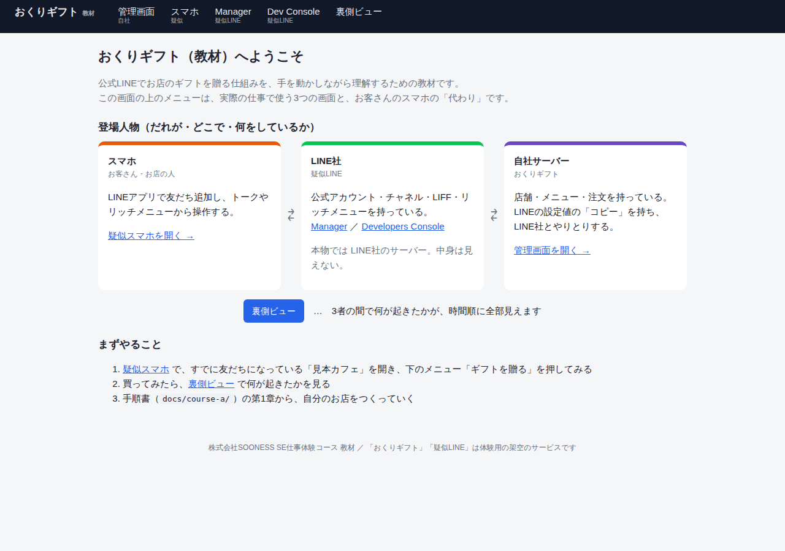
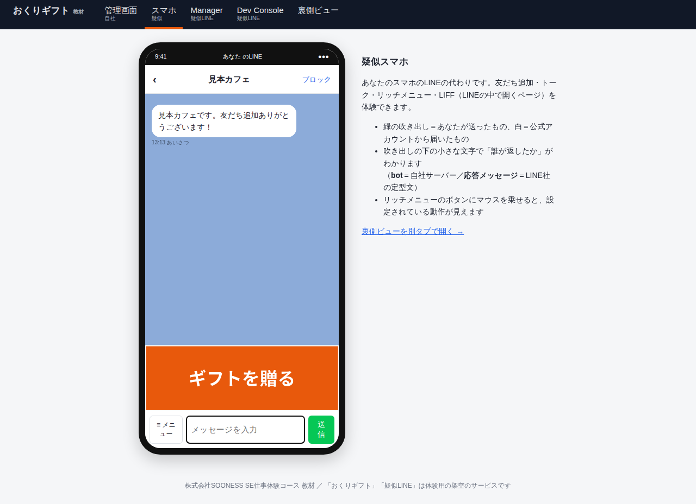
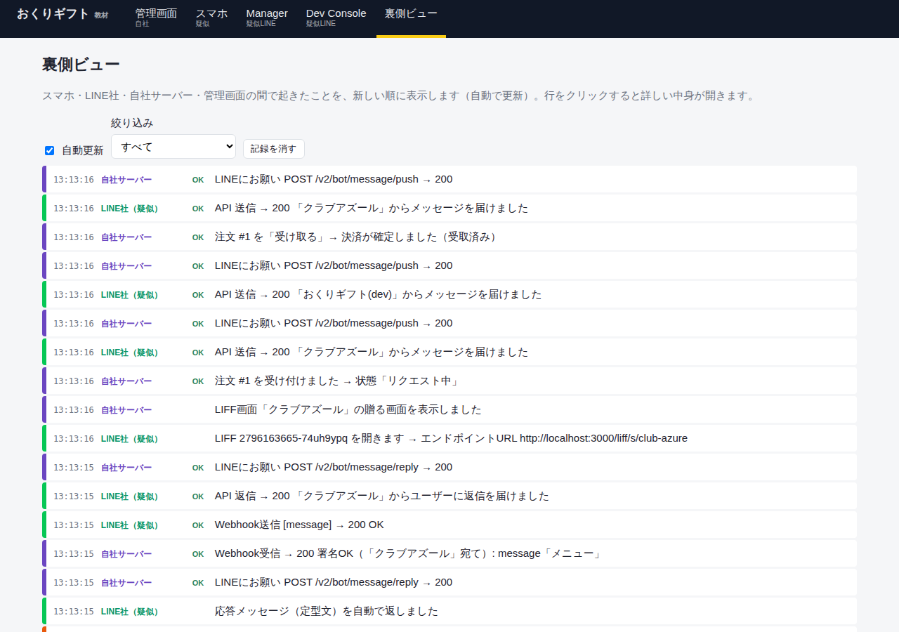

# 公式LINE連携ギフトサービス 体験教材（line-gift-lab）

株式会社SOONESS の「SE・システム開発 仕事体験コース」で使う教材です。

架空のサービス **「おくりギフト」** は、「LINE でお店のギフトを贈る」サービスです。お店を登録して公式LINEとつなぐと、お客さんがLINEの中からそのお店のギフトを買えるようになります。

この教材では、次の2つを体験します。

| コース | 内容 | 使うもの |
|---|---|---|
| **コースA：手順書の「意味」がわかる** | 店舗登録から公式LINE連携、購入・受け取りまでの10ステップを、自分の手で行います。1つずつ「裏側で何が起きているか」を見て、わざと壊して、また直します | この教材アプリだけ（インターネット上のLINEは使いません） |
| **コースB：公式LINEを自分で作れる** | 本物のLINE公式アカウントを作り、あいさつ文やリッチメニューを設定します。できる人は、Webhookで自分のPCのbotとつなぎ、APIでリッチメニューを作り、LIFFまで進みます | 自分のLINEアカウント（または体験用に作ったアカウント）＋この教材アプリ |



---

## 目次

1. [この教材のしくみ](#1-この教材のしくみ)
2. [動かし方（Docker）](#2-動かし方docker)
3. [画面とURLの一覧](#3-画面とurlの一覧)
4. [コースの進め方](#4-コースの進め方)
5. [フォルダ構成と各ファイルの役割](#5-フォルダ構成と各ファイルの役割)
6. [データを初期状態に戻す](#6-データを初期状態に戻す)
7. [よくあるエラーと対処](#7-よくあるエラーと対処)
8. [使っている技術](#8-使っている技術)

---

## 1. この教材のしくみ

公式LINEと連携するサービスには、**3人の登場人物**がいます。

```
 ┌──────────────┐        ┌──────────────────┐        ┌────────────────────┐
 │  スマホ        │  ⇄    │  LINE社            │  ⇄    │  自社サーバー          │
 │ （お客さん／   │        │  公式アカウント       │        │ （おくりギフト）        │
 │   お店の人）   │        │  チャネル・LIFF       │        │  店舗・メニュー・注文    │
 │  LINEアプリ    │        │  リッチメニュー       │        │  管理画面             │
 └──────────────┘        └──────────────────┘        └────────────────────┘
                         Manager / Developers Console      管理画面
                         で設定する                         で設定する
```

本物の世界では、真ん中の「LINE社」の中は見えません。そこでこの教材では、**LINE社の役をする「疑似LINE」** を自分たちで作り、アプリの中に入れています。すべての画面が `http://localhost:3000` で動くので、インターネットにつながなくても、手順書の全ステップをまるごと体験できます。

さらに、3者の間で起きたこと（Webhookが届いた、署名がOKだった、返信をお願いした…）を時間順にすべて表示する **「裏側ビュー」** があります。

| 疑似スマホ | 裏側ビュー |
|---|---|
|  |  |

| 画面 | 役割 | 本物では |
|---|---|---|
| 管理画面 | 自社サービスの運営スタッフが使う | 自社の管理画面 |
| 疑似スマホ | お客さん・お店の人のLINEアプリ | 自分のスマホのLINE |
| 疑似Manager | 公式アカウントの作成・権限・応答設定・リッチメニュー | LINE Official Account Manager（manager.line.biz） |
| 疑似Dev Console | チャネル・LIFF・Webhook・トークン | LINE Developers Console（developers.line.biz） |
| 裏側ビュー | 3者の間で起きたことを見る | （本物にはない。教材だけの特別な窓） |

---

## 2. 動かし方（Docker）

### 必要なもの

- **Docker Desktop**（Windows / Mac）：インストールして**起動しておく**（画面上部のメニューバー／タスクバーにクジラのアイコンが出ていればOK）
- **Git**：ダウンロードに使います（なければ下の「方法B：zipでダウンロード」でもOK）

### 最短手順（慣れている人向け）

```bash
git clone https://github.com/DevSOONESSorg/line-gift-lab.git
cd line-gift-lab
docker compose up
```

起動したら、ブラウザで <http://localhost:3000> を開きます。

---

### 手順（くわしく）

#### ① ターミナルを開く

| OS | 開き方 |
|---|---|
| Windows | スタートメニューで「PowerShell」と入力して開く |
| Mac | `Command + Space` で Spotlight を開き、「ターミナル」と入力して開く |

#### ② 置き場所のフォルダに移動する

迷ったら「デスクトップ」にしましょう。

```bash
cd ~/Desktop
```

> Windows で OneDrive を使っている場合は、デスクトップが `~/OneDrive/Desktop` にあることがあります。

#### ③ 教材をダウンロードする

**方法A：git clone（おすすめ）**

```bash
git clone https://github.com/DevSOONESSorg/line-gift-lab.git
```

`line-gift-lab` というフォルダができればダウンロード完了です。

> `git: command not found`（Macでは「開発者ツールをインストールしますか？」という画面）が出たら、Git がまだ入っていません。Mac はその画面で「インストール」を押せば入ります。Windows は <https://git-scm.com/> からインストールするか、方法Bを使ってください。

**方法B：zipでダウンロード**

1. ブラウザで <https://github.com/DevSOONESSorg/line-gift-lab> を開く
2. 緑色の **「Code」** ボタン →「**Download ZIP**」
3. zip をデスクトップに移して解凍し、フォルダ名が `line-gift-lab-main` なら `line-gift-lab` に変える

#### ④ 教材のフォルダに移動して起動する（初回は1〜2分かかります）

```bash
cd line-gift-lab
docker compose up
```

#### ⑤ 起動を確認する

ターミナルに次の行が出たら起動完了です。

```
おくりギフト（教材）を起動しました → http://localhost:3000
```

ブラウザで <http://localhost:3000> を開き、トップ画面が出れば成功です。

> 起動中は、このターミナルを**閉じないでください**（閉じるとアプリも止まります）。ほかの作業をするときは、新しいターミナルを開きましょう。

### 止め方

アプリを動かしているターミナルで `Ctrl + C`（Macも同じ `Ctrl`）を押したあと、

```bash
docker compose down
```

### 2回目以降の起動

```bash
cd ~/Desktop/line-gift-lab
docker compose up
```

### 自分用の名前・ポートで動かす

1. フォルダの中の `.env.example` を **`.env` という名前でコピー** する
2. `.env` を開いて書き換える（例：`APP_NAME=山田のおくりギフト`、`PORT=3001`）
3. `docker compose up` し直して、<http://localhost:3001> を開く

### コースB：本物のLINEとつなぐとき

本物のLINEからあなたのPCにWebhookを届けるため、**トンネル（インターネットからの入口）** も一緒に起動します。

```bash
docker compose --profile tunnel up
```

くわしくは [コースB：B3](docs/course-b/B3-webhook.md) を見てください。

---

## 3. 画面とURLの一覧

| 画面 | URL |
|---|---|
| トップ（登場人物の説明） | <http://localhost:3000/> |
| 管理画面：店舗管理 | <http://localhost:3000/admin/stores> |
| 管理画面：注文管理／ユーザー管理／売上集計／代理店管理 | `/admin/orders` `/admin/users` `/admin/sales` `/admin/agents` |
| 疑似スマホ | <http://localhost:3000/mock/phone> |
| 疑似Manager | <http://localhost:3000/mock/manager> |
| 疑似Dev Console | <http://localhost:3000/mock/developers> |
| 裏側ビュー | <http://localhost:3000/inside> |
| リッチメニュー用テンプレート画像 | <http://localhost:3000/samples/templates/> |

自社サーバー側の「入口」

| 入口 | URL | 誰が使う |
|---|---|---|
| Webhook（店舗） | `POST /api/webhook/line/store/{slug}` | LINE社 → 自社サーバー |
| Webhook（運営LINE） | `POST /api/webhook/line/platform` | LINE社 → 自社サーバー |
| 贈る画面（LIFF） | `/liff/s/{slug}` | お客さん（LINEの中で開く） |
| 出店登録・店舗管理（LIFF） | `/liff/platform/register` `/liff/platform/manage` | お店の人（LINEの中で開く） |

疑似LINE側の API（本物の `https://api.line.me` の代わり）は `/mock-line-api/v2/bot/...` です。

---

## 4. コースの進め方

| | 内容 | 目安 |
|---|---|---|
| [コースA](docs/course-a/README.md) | 第0章（完成形を触る）→ 第1〜10章（手順書と同じ流れ）→ 障害ドリル | 1日（4時間） |
| [コースB](docs/course-b/README.md) | B0 準備 → B1 公式アカウント → B2 リッチメニュー（Manager）→ B3 Webhook → B4 リッチメニュー（API）→ B5 LIFF → 発展 → 片付け | 1〜2日 |
| [用語集](docs/glossary.md) | わからない言葉が出てきたら | — |
| [職員向けガイド](docs/facilitator.md) | 進行・障害ドリルの仕込み方・答え | — |

**全員が B2 まで**できれば十分です。B3 以降は、早く進んだ人向けです。

---

## 5. フォルダ構成と各ファイルの役割

```
line-gift-lab/
├── README.md
├── docker-compose.yml     ← 起動設定（アプリ本体＋トンネル）
├── Dockerfile
├── .env.example           ← 設定のひな形（コピーして .env にする）
├── package.json
│
├── src/
│   ├── server.js          ← 起動の入口。URLの振り分け
│   ├── config.js          ← 決まりごと（手数料、テストカード、リッチメニューのテンプレート…）
│   ├── seed.js            ← 初回起動時のデータ（運営LINE・見本カフェ）
│   ├── log.js / inside.js ← 裏側ビュー（観察カメラ）
│   ├── util.js            ← 署名の計算・画像サイズの読み取りなど
│   │
│   ├── app/               ← ★自社サービス「おくりギフト」
│   │   ├── db.js          ← 店舗・メニュー・注文・代理店のテーブル
│   │   ├── lineClient.js  ← LINE社へのお願い（返信・送信）
│   │   ├── routes/
│   │   │   ├── webhook.js ← Webhookの受け口（署名の確認）
│   │   │   ├── liff.js    ← LINEの中で開く画面（贈る・出店登録・受け取る）
│   │   │   └── admin.js   ← 管理画面
│   │   └── bot/
│   │       ├── storeBot.js    ← 店舗の公式LINEの返事（コースBで書きかえる）
│   │       └── platformBot.js ← 運営の公式LINEの返事
│   │
│   ├── mockline/          ← ★疑似LINE（LINE社の役）
│   │   ├── core.js        ← 公式アカウント・チャネル・Webhook送信・署名
│   │   └── routes/        ← スマホ／Manager／Developers／API の画面
│   │
│   └── views/             ← 画面（.ejs）
│
├── public/                ← CSS、サンプル画像、リッチメニューのテンプレート画像
├── scripts/
│   ├── reset.js           ← データの初期化
│   ├── drill.js           ← 障害ドリル（職員用）
│   └── richmenu.js        ← コースB：リッチメニューを API で作る
├── richmenus/             ← コースB：リッチメニューの定義（JSON）と画像
├── data/                  ← データベース（app.db = 自社 / mock-line.db = LINE社 / inside.db = 裏側ビュー）
└── docs/                  ← コースの手順書
```

**自社のデータ（`app.db`）と LINE社のデータ（`mock-line.db`）は別のファイル**です。自社が持っているのは「LINEの設定値のコピー（5つの値）」だけ、という点がこの仕組みを理解するカギです。

---

## 6. データを初期状態に戻す

```bash
# アプリを止めてから
docker compose run --rm app npm run reset
docker compose up
```

`data/` の中の `.db` ファイルを手で削除しても同じです。

---

## 7. よくあるエラーと対処

| 症状 | 原因と対処 |
|---|---|
| `port is already allocated` | 同じポートを別のアプリ（bihin-app など）が使っている。止めるか、`.env` の `PORT` を 3001 などに変える |
| `Cannot connect to the Docker daemon` | Docker Desktop が起動していない。起動してから再度 `docker compose up` |
| ブラウザで「接続できません」 | まだ起動中。「起動しました」が出るまで待つ |
| 疑似スマホで bot が返事をしない | [裏側ビュー](http://localhost:3000/inside) で NG の行を探す。コースAの[困ったとき](docs/course-a/11-drill.md#困ったときの見る場所)の表を見る |
| `no such column` などDBのエラー | 古いデータが残っている。「データを初期状態に戻す」を実行 |
| コースBで Verify が失敗する | トンネルのURLが変わっていないか確認（起動するたびに変わります） |

エラーの意味がわからないときは、**エラーメッセージをそのまま**AIに貼って「このエラーの意味と、どのファイルを見ればいいか教えて」と聞いてかまいません。

---

## 8. 使っている技術

| 役割 | 技術 | 選んだ理由 |
|---|---|---|
| 言語 | JavaScript（Node.js 20） | 画面もサーバーも1つの言語で読める |
| Webフレームワーク | Express 4 | URLと処理の対応が読みやすい |
| 画面 | EJS | HTMLの中に `<%= %>` を書くだけ |
| データベース | SQLite（better-sqlite3） | ファイル1つ。DBサーバーがいらない |
| 実行環境 | Docker Compose | 全員が同じ状態で動かせる |
| トンネル（コースB） | Cloudflare Quick Tunnel（cloudflared） | アカウント登録なしで https の入口が作れる |

---

## 大事な注意

- 「おくりギフト」「疑似LINE」は体験用の**架空のサービス**です。実在のサービスのURL・ID・パスワードは含まれていません。
- 疑似LINEは、本物のLINEの画面や動きを**わかりやすく単純化**したものです。本物の画面の文言や配置は変わることがあります。
- コースBで使う本物のLINEの設定値（チャネルシークレット、アクセストークン）は、**人に見せない・スクリーンショットに写さない・GitHubに上げない**でください。

## ライセンス

MIT License

## 作成

株式会社SOONESS（就労継続支援A型）SE仕事体験コース
