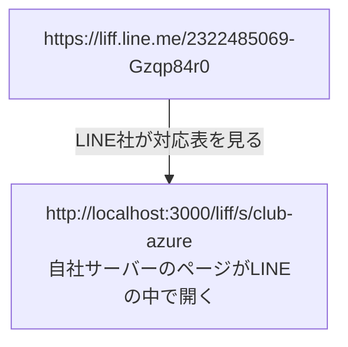

# 第4章 LINEログインチャネルと LIFF を作る（贈る画面の入口）

> 手順書 第4章に対応 ／ 使う画面：Dev Console（会社の作業アカウント）
>
> この章でわかること：LIFF は「LINEの中で開く自社のWebページ」 ／ LIFF ID とエンドポイントURLの関係 ／ なぜ名前を入れなくても誰かわかるのか ／ 本番と同じ設定値（Full・openid と profile・友だち追加オプション）の理由
>
> 構築ナビの手順7（ログインチャネル）・手順8（LIFF）・手順9（公式アカウントのリンク）にあたります

## やること

### ① LINEログインチャネルを作って「公開」にする（手順7）

1. [疑似Dev Console](http://localhost:3000/mock/developers) を開く（ログイン中：**会社の作業アカウント**）
2. **おくりギフト運営プロバイダー（株式会社サンプル）** を開く
3. **新規チャネル作成** → チャネルの種類 **LINEログイン**（Messaging API は選べない。Manager から作るため）を選び、次のとおりに入れる

   | 項目 | 入れる値 |
   |---|---|
   | 所在国・地域 | 日本 |
   | チャネル名 | `おくりギフト {店名} LIFF`（例：`おくりギフト クラブ アズール LIFF`）。**20文字まで**。超えるときは店名を短くする（例：`おくりギフト アルカディア LIFF`） |
   | チャネル説明 | 何でもよいが **必須**（例：`クラブ アズール ギフト用LIFF`） |
   | アプリタイプ | **ウェブアプリ** |
   | 2要素認証の必須化 | **オフ**（最初はオンになっているので切り替える） |
   | メールアドレス | `info@okuri-gift.example`（会社の共通のアドレス。最初は個人のアドレスが入っているので消す） |
   | プライバシーポリシーURL | `https://okuri-gift.example/privacy` |
   | サービス利用規約URL | 空でよい |

4. **開発者契約に同意** にチェック → **作成**
5. できたチャネルの **チャネル基本設定** タブで、チャネルの状態の **公開** を押す →「**公開済み**」になれば完了（本番でいちばん忘れやすいポイント）

> 入れまちがえたときは、チャネル基本設定の **編集** で直せます。構築ナビは「どこがちがうか」を赤い枠で教えてくれます。

### ② LIFF アプリを追加する（手順8）

6. 同じチャネルの **LIFF** タブ → **追加** → 次のとおりに入れて **追加**

   | 項目 | 入れる値 |
   |---|---|
   | LIFFアプリ名 | `{slug}-gift`（例：`club-azure-gift`） |
   | サイズ | **Full**（全画面） |
   | エンドポイントURL | 管理画面の店舗編集にある「LIFF のエンドポイントURL」を **コピー** して貼る（例：`http://localhost:3000/liff/s/club-azure`） |
   | Scope | **openid** と **profile** の2つだけ（chat_message.write は付けない） |
   | 友だち追加オプション | **On (normal)** |

7. 表の中に **LIFF ID**（例 `2322485069-Gzqp84r0`）と **LIFF URL**（`https://liff.line.me/{LIFF ID}`）が出る。**目で写さない**でください。第5章・第8章で、ここから **コピー** します
8. 値をまちがえたときは、表の **LIFFアプリ名** を押す →「**LIFFアプリ詳細**」が開き、サイズ・エンドポイントURL・Scope・友だち追加オプションを1つずつ直せます（LIFF ID のコピーもここ）

### ③ お店の公式アカウントをリンクする（手順9）

9. 同じチャネルの **チャネル基本設定** タブの下、「**友だち追加オプション**」の「**リンクされたLINE公式アカウント**」で、このお店の @ID を選ぶ（@ID は Manager の「アカウント設定」で確かめる）→ **更新**
   - 選べるのは、同じプロバイダーに Messaging API チャネルがある公式アカウントだけです（第3章で有効にしたので、出てきます）

## 裏側を見る

- LINE社：LINEログインチャネルを作成しました
- LINE社：LIFFアプリを追加しました（LIFF ID: …）→ `https://liff.line.me/{LIFF_ID}` を開くと、このURLのページがLINEの中で開きます
- （第8章のあと、お客さんが LIFF を開いたとき）LINE社：友だち追加オプション：「○○」の友だち追加をすすめました … リンクしていないと「リンクされたLINE公式アカウントがないので、友だち追加をすすめられません」と出ます

## なぜ？

**Q. LIFF って何？**
**L**INE **F**ront-end **F**ramework の略で、ひとことで言うと「**LINEの中で開く、自社のWebページ**」です。第0章で「ギフトを贈る」を押して開いたページ（お店を選ぶ画面も、贈る画面も）は、LINE社のページではなく、**自社サーバー（おくりギフト）が作ったページ**でした。

**Q. LIFF ID とエンドポイントURLの関係は？**
LINE社は「LIFF ID → エンドポイントURL」の対応表を持っています。

お客さんに配るのは `https://liff.line.me/{LIFF_ID}` のほう（QRコードやリッチメニューに入れる）。本当の行き先（エンドポイントURL）はLINE社の中で決まります。

**Q. なぜ名前を入れていないのに「ようこそ ○○ さん」と出たの？**
Scope に **profile** を付けたからです。LIFFのページは、LINEから「いま開いている人のユーザーIDと名前」を受け取れます（本物では LIFF SDK の `liff.getProfile()`。[resources/views/liff/store.blade.php](../../resources/views/liff/store.blade.php) の下の方にあります）。だから自社サーバーは「誰が買ったか」がわかり、その人のLINEにお知らせを送れます。

**Q. なぜ Messaging API チャネルではなく、LINEログインチャネルに作るの？**
LIFF は「LINEでログインしてもらう」しくみの上に乗っているからです。LIFF は LINEログインチャネルにしか追加できません。
ただし、**Messaging APIチャネルと同じプロバイダーに作る**のがポイントです（同じ箱の中なので、LIFFで分かったユーザーIDに、Messaging APIでメッセージを送れる）。

**Q. なぜサイズは Full？**
贈る画面では、商品を選び、カードを入れて、支払いまでします。トークの上に少しだけ出る画面（Tall・Compact）では狭いので、**全画面（Full）** にします。本番のお店の LIFF も Full です。

**Q. なぜ Scope は openid と profile だけ？ chat_message.write は？**
贈るのに必要なのは「誰が開いたか」（ユーザーIDと名前）だけです。**使わない権限は付けない** のが基本です。
`chat_message.write` は、LIFF の画面から **お客さん本人の発言として** トークにメッセージを送れる権限です（`liff.sendMessages()`）。付けると、LIFF を開くときの同意画面で許可を求める項目が増えます。本番のお店の LIFF には付けていません。教材でも、この Scope がない LIFF では、完了画面の「トークに『贈りました』と送る」ボタンは出ません。

**Q. 友だち追加オプションと「リンクされたLINE公式アカウント」は？**
友だち追加オプションを On にすると、LIFF を開いたとき、**リンクした公式アカウント** の友だち追加をすすめてくれます。友だちでないとお知らせ（push）が届かないので、オンにします。
ただし、**どの公式アカウントをすすめるか** は、LINEログインチャネルの「リンクされたLINE公式アカウント」で決まります。リンクしないと、友だち追加オプションは効きません。だから手順9があります。

**Q. チャネル名・メール・2要素認証は、なぜ決まっているの？**
- **チャネル名**：本番では LINE の画面に出る名前で、LINE の決まりで20文字までです。「おくりギフト {店名} LIFF」とそろえておくと、たくさんのお店のチャネルが並んでも見分けられます
- **メールアドレス**：LINE社からの大事なお知らせが届きます。個人のアドレスだと、担当者が変わったときに届かなくなるので、会社の共通のアドレスにします
- **2要素認証の必須化**：オンだと、お客さんがログインするときに手間が増えます。お客さん向けの LIFF ではオフにします

## 本物の仕事では

- 本番（prod）でも、所在国・チャネル説明・メールアドレス・プライバシーポリシーURLの入力が必須です（教材も同じにしてあります）
- **チャネルを「公開（Published）」に切り替えない** と、一般のお客さんは LIFF を開けません（開発中のままだと、チャネルの管理者・テスターしか開けない）。本番で実際に、公開を忘れてお客さんに「bad request」と出たことがあります
- エンドポイントURLは環境ごとにちがいます（dev / stg / prod で別のドメイン）。だから目で写さず、管理画面からコピーします

## 壊してみよう（第8章のあとで。あとで必ず戻す）

| 実験 | 結果 |
|---|---|
| チャネル基本設定で「開発中に戻す」を押し、お客さんのスマホで「ギフトを贈る」を押す | 「**400 Bad Request**」と出て開けない（本番の「bad request」と同じ）。「公開」に戻すと開ける |

## チェック問題

1. お客さんが押すリッチメニューのボタンには、`https://liff.line.me/…` と エンドポイントURL のどちらを入れますか？
2. エンドポイントURLの slug を、別のお店の slug にしてしまうとどうなりますか？（第11章のドリルで出ます）
3. LINEログインチャネルを「開発中」のままにすると、お客さんが LIFF を開いたとき何が起きますか？
4. 友だち追加オプションを On にしたのに、友だち追加をすすめてくれません。どこを確かめますか？
