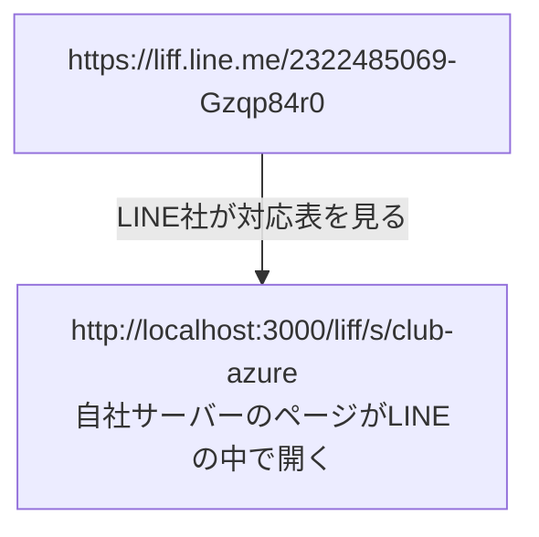

# 第4章 LIFF を作る（贈る画面の入口）

> 手順書 第4章に対応 ／ 使う画面：Dev Console（会社の作業アカウント）
>
> この章でわかること：LIFF は「LINEの中で開く自社のWebページ」 ／ LIFF ID とエンドポイントURLの関係 ／ なぜ名前を入れなくても誰かわかるのか

## やること

1. [疑似Dev Console](http://localhost:3000/mock/developers) を開く（ログイン中：**会社の作業アカウント**）
2. **おくりギフト運営プロバイダー（株式会社サンプル）** を開く
3. **新規チャネル作成** → チャネルの種類 **LINEログイン**、チャネル名（例：`クラブアズール LIFF`）、アプリタイプ **ウェブアプリ** にチェック → **作成**
4. できたチャネルの **LIFF** タブ → 「追加」欄に入力して **追加**

   | 項目 | 入れる値 |
   |---|---|
   | サイズ | Full（手順書は Tall/Full） |
   | エンドポイントURL | `http://localhost:3000/liff/s/{slug}`（管理画面の編集ページの「LIFFのエンドポイントURL」をコピーすると確実） |
   | Scope | profile・openid |

5. 表の中に **LIFF ID**（例 `2322485069-Gzqp84r0`）が出る。控える

LIFF タブに、いま作った LIFF ID とエンドポイントURLが並んでいればOKです。

## 裏側を見る

- LINE社：LINEログインチャネルを作成しました
- LINE社：LIFFアプリを追加しました（LIFF ID: …）→ `https://liff.line.me/{LIFF_ID}` を開くと、このURLのページがLINEの中で開きます

## なぜ？

**Q. LIFF って何？**
**L**INE **F**ront-end **F**ramework の略で、ひとことで言うと「**LINEの中で開く、自社のWebページ**」です。第0章で「ギフトを贈る」を押して開いたページ（お店を選ぶ画面も、贈る画面も）は、LINE社のページではなく、**自社サーバー（おくりギフト）が作ったページ**でした。

**Q. LIFF ID とエンドポイントURLの関係は？**
LINE社は「LIFF ID → エンドポイントURL」の対応表を持っています。

お客さんに配るのは `https://liff.line.me/{LIFF_ID}` のほう（QRコードやリッチメニューに入れる）。本当の行き先（エンドポイントURL）はLINE社の中で決まります。

**Q. なぜ名前を入れていないのに「ようこそ ○○ さん」と出たの？**
Scope に **profile** を付けたからです。LIFFのページは、LINEから「いま開いている人のユーザーIDと名前」を受け取れます（本物では LIFF SDK の `liff.getProfile()`。[liff/store.ejs](../../src/views/liff/store.ejs) の下の方にあります）。だから自社サーバーは「誰が買ったか」がわかり、その人のLINEにお知らせを送れます。

**Q. なぜ Messaging API チャネルではなく、LINEログインチャネルに作るの？**
LIFF は「LINEでログインしてもらう」しくみの上に乗っているからです。LIFF は LINEログインチャネルにしか追加できません。
ただし、**Messaging APIチャネルと同じプロバイダーに作る**のがポイントです（同じ箱の中なので、LIFFで分かったユーザーIDに、Messaging APIでメッセージを送れる）。

## 本物の仕事では

- 本番（prod）では、プライバシーポリシーURLと所在国（日本）の入力が必須です
- さらに **チャネル本体を「公開（Published）」に切り替えない** と、一般のお客さんは LIFF を開けません（開発中のままだと、権限のある人しか開けない）
- エンドポイントURLは環境ごとにちがいます（dev / stg / prod で別のドメイン）

## チェック問題

1. お客さんが押すリッチメニューのボタンには、`https://liff.line.me/…` と エンドポイントURL のどちらを入れますか？
2. エンドポイントURLの slug を、別のお店の slug にしてしまうとどうなりますか？（第11章のドリルで出ます）
