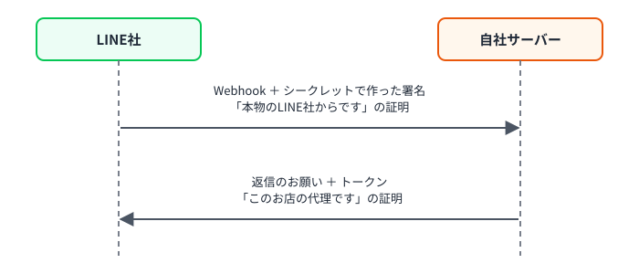

# 第5章 管理画面でつなぐ（5つの値）＋ Webhook URL を取る

> 手順書 第5章に対応 ／ 使う画面：Dev Console・管理画面
>
> この章でわかること：自社サーバーは「LINEの設定値のコピー」を持っている ／ 5つの値それぞれの役割 ／ **値は目で写さず、必ずコピーで貼る** 理由
>
> 構築ナビの手順10（トークン発行）・手順11（5つの値）にあたります

## やること

### トークンを発行する（手順10）

1. [Dev Console](http://localhost:3000/mock/developers) → 運営のプロバイダー → **第3章で有効にした Messaging API チャネル**（クラブ アズール）を開く
2. **Messaging API設定** タブの一番下「チャネルアクセストークン（長期）」で **発行** を押す（長い文字列は人に見せない・チャットに貼らない）

### 管理画面に入れる（手順11）

3. 管理画面 → クラブ アズールの **編集** →「LINE 連携設定（店舗専用チャネル）」を開く（コピー元の画面とは **別のタブ** で開くと楽）
4. 5つの値を、コピー元の画面の **コピー** から1つずつ貼る。**目で見て打ち直さない**

   | 入力欄 | 形 | コピー元 |
   |---|---|---|
   | LIFF ID | `2322485069-Gzqp84r0` の形 | LINEログインチャネルの LIFF タブ → LIFFアプリ名を押す →「LIFFアプリ詳細」の **コピー** |
   | Messaging API チャネルID | 10桁の数字 | **Messaging API チャネル** の「チャネル基本設定」（LINEログインチャネルのIDではない） |
   | チャネルシークレット | 32文字 | 同じ「チャネル基本設定」 |
   | アクセストークン（長期） | 長い文字列 | 同じチャネルの「Messaging API設定」タブのいちばん下 |
   | LINE公式アカウントID（@xxx） | `@123abcde` の形 | Manager の「アカウント設定」のベーシックID |

5. 貼ったら、コピー元と **最初と最後の数文字** を見比べる
6. 最下部の **更新** で保存
7. 下の「LINE 連携 確認 / テスト」カードの **設定整合性** を見る。このページを開くたびに **自動で** 確かめてくれます（ボタンを押す必要はありません）→ **すべてOK** になれば、形とトークンの持ち主は正しい合図
8. 同じカードの **Webhook URL** を **コピー** する（次の章で使う）

> シークレットとトークンは、保存すると「設定済み」表示になり、入力欄は空になります。空欄のまま保存しても値は消えません。変えるときだけ入れ直します。
> DB には **暗号化して** 保存されます（`app/Models/Store.php` の `'encrypted'`）。DB ファイルを見られても、そのままでは使えません。

## なぜ？

**Q. 5つの値はそれぞれ何のため？**

| 値 | たとえると | 何に使う |
|---|---|---|
| LIFF ID | 贈る画面の「入口番号」 | 店舗紐づけQRコードを作る（`https://liff.line.me/{LIFF_ID}`） |
| チャネルID | 相手の「名札」 | どのチャネルの話かを区別する |
| チャネルシークレット | LINE社と自社だけが知っている「合言葉」 | 届いたWebhookが本物のLINE社からかを確かめる（第6章） |
| アクセストークン | LINE社に話しかける「通行証」 | 返信・メッセージ送信をお願いするとき、毎回見せる |
| 公式アカウントID | お店の「電話番号」 | 友だち追加のリンク（`line.me/R/ti/p/@xxx`） |

**Q. シークレットとトークンは何がちがうの？**
向きがちがいます。

シークレットそのものは、**ネットの上を一度も流れません**。どちらも同じシークレットを持っていて、それぞれ計算した結果（署名）を比べるだけです。だから「合言葉」なのです。

**Q. 設定整合性では何をしているの？**
形のチェック（10桁か、32文字か…）に加えて、**トークンを使って実際にLINE社に「このトークンは誰のもの？」と聞いています**（`GET /v2/bot/info` と `POST /v2/oauth/verify`）。答えのチャネルID・公式アカウントIDと、入力した値が同じなら、別のお店や別のチャネルの値が混ざっていないとわかります。
ページを開くたびに自動で表示されます（本番の管理画面と同じ）。結果を裏側ビューにも残したいときは、横の「裏側ビューに記録」を押します。

**Q. 設定整合性が「すべてOK」なら、もう安心？**
いいえ。設定整合性は、**LIFF ID が LINE 側に本当にあるかまでは確かめません**（形だけ見ます。本番の管理画面も同じです）。LIFF ID を1文字まちがえても「OK」のままです。まちがいに気づくのは、お客さんが開いたときです。だから、

- LIFF ID は **必ずコピーで貼る**
- 最後は **スマホで押して確かめる**（第8章・第10章）

**Q. なぜ「目で写さない」がそんなに大事？**
LIFF ID には、見分けにくい文字が入っています。**I（大文字のアイ）と l（小文字のエル）**、**O（大文字のオー）と 0（ゼロ）** です。本番で実際に、LIFF ID の I と l を見まちがえて打ち、お客さんが開くと「**システムエラー**」になったことがあります。
この教材の LIFF ID には、わざと必ずこれらの文字が入っています。1文字だけちがう値を入れると、構築ナビが「I と l、O と 0 を見まちがえていませんか？」と教えてくれます（本番では教えてくれません）。

## 壊してみよう（あとで必ず元に戻す）

1. Messaging API チャネルID の欄に、**LINEログインチャネルのID**（第4章で作ったほう）を入れて更新 → 設定整合性を見る
   → 形は同じ10桁なので「形」のチェックはOK。でも「トークンとチャネルIDが同じチャネル」がNGになる
2. 公式アカウントID に、**シャンパンバー ルミエールの @xxx** を入れて更新 →「トークンと公式アカウントIDが同じアカウント」がNG
3. LIFF ID の中の `I` を `l` に（または `O` を `0` に）1文字だけ変えて更新 → **設定整合性は OK のまま**。構築ナビだけが「1文字ちがいます」と教えてくれる
   → 店舗詳細の「店舗紐づけQRコード」を **お客さんのスマホで読み取る** と、「**システムエラー** LIFF app '…' was not found.」
4. 元の値（コピーで貼り直す）に戻して、すべてOKに戻す

> ID の取り違えは「形」だけ見ても分かりません。だからチェックでは、実際にLINE社に「このトークンはどのチャネルのもの？」（`POST /v2/oauth/verify`）と聞いて照らし合わせています。

## チェック問題

1. 5つの値のうち、Messaging API チャネルから取るのはどれ？（3つ）
2. シークレットとトークン、LINE社にお願いするときに見せるのはどっち？
3. トークンを Dev Console で「再発行」したのに、管理画面を更新しなかったら、どうなると思う？
4. 設定整合性がすべて OK なのに、お客さんが開くと「システムエラー」になりました。何を疑いますか？
