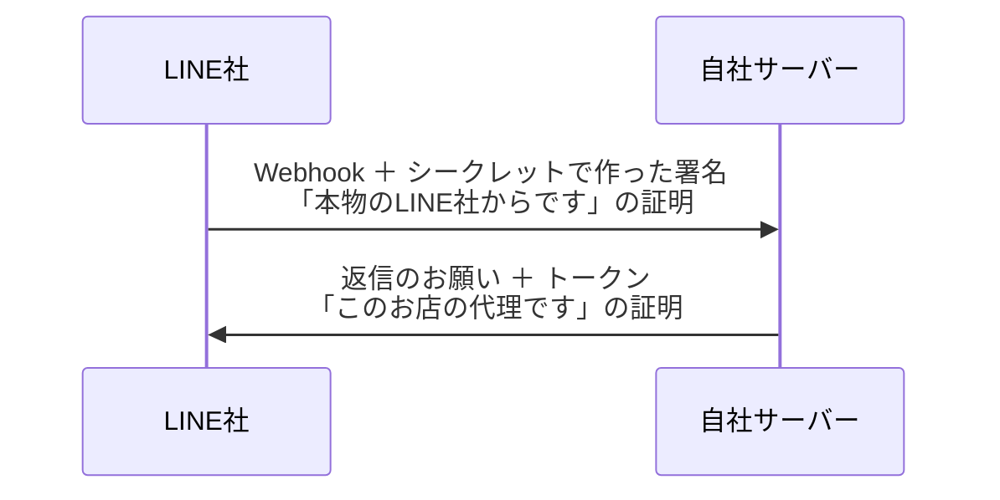

# 第5章 管理画面でつなぐ（5つの値）＋ Webhook URL を取る

> 手順書 第5章に対応 ／ 使う画面：Dev Console・管理画面
>
> この章でわかること：自社サーバーは「LINEの設定値のコピー」を持っている ／ 5つの値それぞれの役割

## やること

### Dev Console で値を控える

1. [Dev Console](http://localhost:3000/mock/developers) → 運営のプロバイダー → **第3章で作ったお店の Messaging API チャネル**（お店の名前のもの）を開く
2. **Basic settings** タブで **Channel ID** と **Channel secret** を控える
3. **Messaging API** タブの「チャネルアクセストークン（長期）」で **発行** を押し、トークンを控える

### 管理画面に入れる

4. 管理画面 → 自分のお店の **編集** →「LINE 連携設定（店舗専用チャネル）」に入力

   | 入力欄 | 入れる値 | どこで取った？ |
   |---|---|---|
   | LIFF ID | `2322485069-Gzqp84r0` の形 | 第4章（LINEログインチャネルの LIFF タブ） |
   | Messaging API チャネルID | 10桁の数字 | Messaging APIチャネルの Basic settings |
   | チャネルシークレット | 32文字 | Messaging APIチャネルの Basic settings |
   | アクセストークン（長期） | 長い文字列 | Messaging APIチャネルの Messaging API タブ |
   | LINE公式アカウントID（@xxx） | `@123abcde` の形 | 第3章（Manager のアカウント設定） |

5. 最下部の **更新** で保存
6. 下の「LINE 連携 確認 / テスト」カードの **設定整合性をチェック** を押す → **すべてOK** になれば、値が正しく入った合図
7. 同じカードの **Webhook URL** を **コピー** する（次の章で使う）

> シークレットとトークンは、保存すると「設定済み」表示になり、入力欄は空になります。空欄のまま保存しても値は消えません。変えるときだけ入れ直します。

## なぜ？

**Q. 5つの値はそれぞれ何のため？**

| 値 | たとえると | 何に使う |
|---|---|---|
| LIFF ID | 贈る画面の「入口番号」 | 店舗紐づけQRコードを作る（`https://liff.line.me/{LIFF_ID}`） |
| チャネルID | 相手の「名札」 | どのチャネルの話かを区別する |
| チャネルシークレット | LINE社と自社だけが知っている「合言葉」 | 届いたWebhookが本物のLINE社からかを確かめる（第6章） |
| アクセストークン | LINE社に話しかける「通行証」 | 返信・メッセージ送信をお願いするとき、毎回見せる |
| 公式アカウントID | お店の「電話番号」 | 友だち追加のリンク（`line.me/R/ti/p/@xxx`） |

**Q. シークレットとトークンは何がちがうの？**
向きがちがいます。

シークレットそのものは、**ネットの上を一度も流れません**。どちらも同じシークレットを持っていて、それぞれ計算した結果（署名）を比べるだけです。だから「合言葉」なのです。

**Q. 設定整合性チェックでは何をしているの？**
形のチェック（10桁か、32文字か…）に加えて、**トークンを使って実際にLINE社に「このトークンは誰のもの？」と聞いています**（`GET /v2/bot/info` と `POST /v2/oauth/verify`）。答えのチャネルID・公式アカウントIDと、入力した値が同じなら、別のお店や別のチャネルの値が混ざっていないとわかります。裏側ビューで確かめましょう。

## 壊してみよう（あとで必ず元に戻す）

1. Messaging API チャネルID の欄に、**LINEログインチャネルのID**（第4章で作ったほう）を入れて更新 → チェック
   → 形は同じ10桁なので「形」のチェックはOK。でも「トークンとチャネルIDが同じチャネル」がNGになる
2. 公式アカウントID に、**見本カフェの @xxx** を入れて更新 → チェック →「トークンと公式アカウントIDが同じアカウント」がNG
3. 元の値に戻して、すべてOKに戻す

> ID の取り違えは「形」だけ見ても分かりません。だからチェックでは、実際にLINE社に「このトークンはどのチャネルのもの？」（`POST /v2/oauth/verify`）と聞いて照らし合わせています。

## チェック問題

1. 5つの値のうち、Messaging API チャネルから取るのはどれ？（3つ）
2. シークレットとトークン、LINE社にお願いするときに見せるのはどっち？
3. トークンを Dev Console で「再発行」したのに、管理画面を更新しなかったら、どうなると思う？
