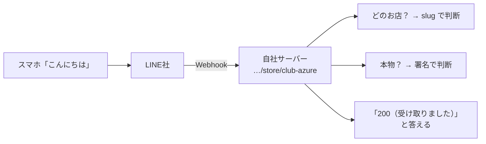

# 第6章 Webhook を登録する

> 手順書 第6章に対応 ／ 使う画面：Dev Console
>
> この章でわかること：Webhook は「LINE社 → 自社サーバー」の通知 ／ Verify の 200 の意味 ／ 署名のしくみ

## やること

1. Dev Console → お店の Messaging API チャネル → **Messaging API** タブ
2. **Webhook URL** 欄に、第5章でコピーしたURLを貼って **Update**

   ```
   http://localhost:3000/api/webhook/line/store/{slug}
   ```

3. **Verify** を押す → **Success（200）** が出ればOK
4. **Use webhook** を **ON** にする

## 裏側を見る

Verify を押したあとの裏側ビューを開き、行をクリックして中身を見てみましょう。

- **LINE社：Webhook送信 [検証（Verify）] → 200 OK**
  - 送信先 … 貼ったURL
  - `X-Line-Signature: …`（チャネルシークレットで計算）
  - 本文 … `{"destination": "...", "events": []}`（中身が空＝接続確認だけ）
- **自社サーバー：Webhook受信 → 200 署名OK**
  - slug「club-azure」→ 店舗「クラブアズール」と判断
  - シークレットで計算した署名が一致 → 本物のLINE社からの通知と確認

## なぜ？

**Q. Webhook って何？**
「何かが起きたら、このURLに知らせてね」という登録です。お客さんがトークで話しかけたり、友だち追加したりすると、LINE社がそのURLに **POST** で知らせてくれます（これを「イベント」と呼びます）。自社サーバーはそれを受け取って、返事の内容を考えます。



**Q. Verify の「200」は何？**
HTTP のステータスコードで、**「受け取りました。問題ありません」** という答えです。よく出てくる番号を覚えておきましょう。

| 番号 | 意味 | この教材でどんなときに出る |
|---|---|---|
| 200 | OK | 正しく受け取れた |
| 401 | 本人確認に失敗 | 署名が合わない（シークレット違い）／トークンが無効 |
| 404 | 見つからない | URL の slug が間違っている |
| 500 | サーバーの中のエラー | シークレットが未設定 など |
| 0（つながらない） | そもそも届かない | サーバーが止まっている／URLのホストやポートが違う |

**Q. 署名（X-Line-Signature）って何？**
Webhook URL は、知っていれば誰でも POST できてしまいます。そこで LINE社は、送る本文を **チャネルシークレットで計算した値**（署名）を添えて送ります。自社サーバーも、自分が持っているシークレットで同じ計算をして、一致すれば「本物のLINE社から・書きかえられていない」とわかります。
計算は [src/util.js](../../src/util.js) の `sign()` の1行です（HMAC-SHA256 という方式）。

## 壊してみよう（あとで必ず元に戻す）

| 実験 | やり方 | 結果（Verify） | 裏側ビューで見えること |
|---|---|---|---|
| slug の打ち間違い | Webhook URL の最後を `club_azure` などに変えて Update | Error 404 | 「club_azure という slug の店舗はありません」 |
| slug を変える | 管理画面でお店の slug を変えて更新 | Error 404 | 第1章の「slug は変えない」の理由がこれ |
| シークレットの再発行 | Basic settings でシークレットを **再発行** | Error 401 | 「署名が合いません」… 届いた署名と自分で計算した署名がちがう |
| ポート違い | URL の `3000` を `3999` に | Error（接続できません） | 「つながりませんでした」 |

**直し方**：URL・slug を戻す／再発行した新しいシークレットを管理画面に入れ直して更新 → もう一度 Verify で 200 を確認。

## チェック問題

1. Webhook を送るのは誰で、受け取るのは誰？
2. Verify が 401 になりました。何を疑いますか？
3. Verify が 404 になりました。何を疑いますか？
