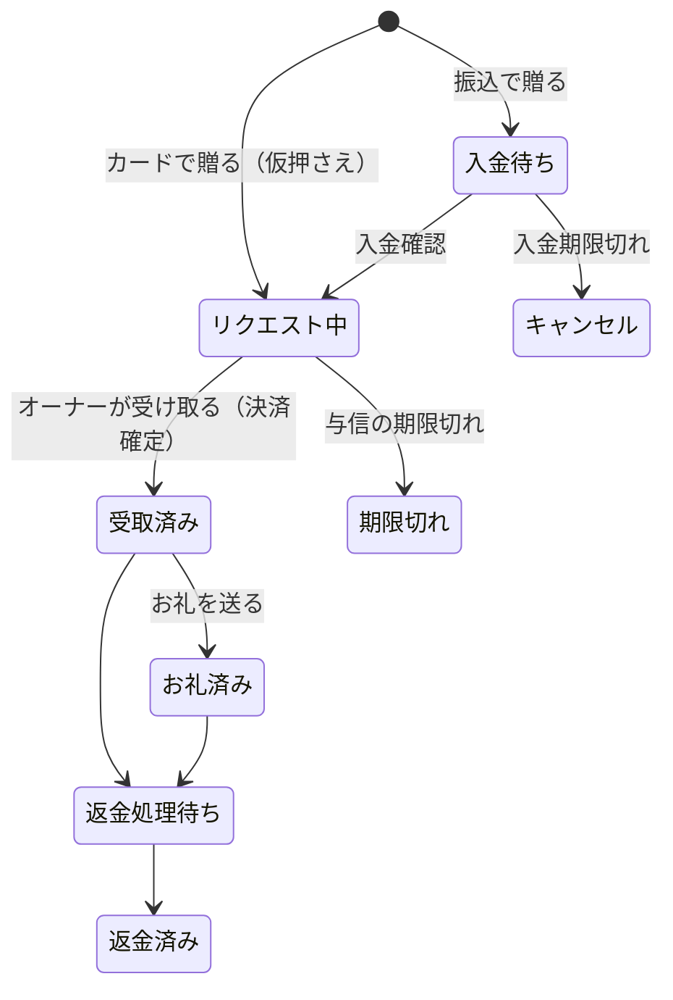

# 第10章 2つの入口から贈って、受け取り・お礼まで体験する（動作確認）

> 手順書 第10章に対応 ／ 使う画面：スマホ（お客さん役・オーナー役）・管理画面
>
> この章でわかること：「購入」と「決済の確定」はちがうタイミング ／ カードと銀行振込で流れがちがう ／ 注文の状態の移り変わり ／ お知らせは「来た道」の公式LINEから

本物の仕事では、運営スタッフがスマホを触るのは、構築が終わったあとの **この動作確認** のときです。

> 構築ナビの手順15（お客さんのスマホから贈る）・手順16（オーナーが受け取る）・手順17（引き渡し前の最終確認）にあたります。手順15・16は下の「贈る①」と「受け取る」、手順17は [引き渡し前の最終確認](#引き渡し前の最終確認手順17) です

## やること

### 贈る①：オリジナル（お店の公式LINEから）— お客さん役

1. 左（お客さん）のスマホで **クラブ アズールの公式LINE** → リッチメニューの「ギフトを贈る」から贈る画面を開き、**この商品を送る**
   - 管理画面の店舗詳細の「店舗紐づけQRコード」→ **お客さんのスマホで読み取る** でも同じ画面が開きます
2. 支払いで **＋ 新しいカードを追加** を選び、まず **失敗するカード** で払ってみる

   | カード番号 | 結果 |
   |---|---|
   | `4000 0000 0000 0002` | 「カードが拒否されました」 |
   | `4242 4242 4242 4242` | 成功（このカードが登録される） |

3. 成功 → 状態は **リクエスト中**（まだ決済されていない）。お店の公式LINEから「ご注文ありがとうございます」が届く
4. 完了画面を見る。構築したお店の LIFF は Scope が openid と profile だけなので、「トークに『贈りました』と送る」ボタンは **出ません**（`chat_message.write` がないため。第4章）

### 贈る②：銀行振込 — お客さん役

5. もう一度 **クラブ アズールの公式LINE** → 店舗ページ → 商品を選ぶ
6. 支払いを **銀行振込** にして **銀行振込で注文する**
7. 状態は **入金待ち**。振込先と期限が表示され、クラブ アズールの公式LINEからも届く

### 入金を確認する — 運営スタッフ

8. 管理画面の [注文管理](http://localhost:3000/admin/orders) → 入金待ちの注文の **詳細** → **入金を確認した**（教材の練習用ボタン）
9. 状態が **リクエスト中** に変わり、オーナーに「ギフトが届きました」が届く

### 受け取る・お礼を送る — オーナー役（右のスマホ）

10. おくりギフト(dev) の「贈られました」のリンク（または **店舗管理**）→ クラブ アズールの **贈り物一覧** → **贈り物を受け取る** → **この贈り物を受け取る**（ここで決済が確定）
11. **お礼を送る**：メッセージ（と、あれば短い動画）を送る → **お礼済み**
12. お客さん（左）に戻って、お店の公式LINEに届いた「お礼が届きました」の **リンク** からお礼一覧を開く。下のタブの **贈った履歴** から **領収書** も出してみる

### 期限切れを体験する

13. もう1つ、カードでギフトを贈る（リクエスト中のまま置いておく）
14. 職員に頼んで（または自分で）ターミナルで次を実行

    ```bash
    docker compose exec app php artisan lab:time-travel {注文ID}
    ```

15. 1分以内に、その注文が **期限切れ** になる（スケジューラーが自動で処理。すぐなら `php artisan orders:expire`）

### 確認する — 運営スタッフ

16. 注文詳細の **状態の移り変わり** の表で、だれが・いつ・何から何へ変えたかを確認
17. [売上集計](http://localhost:3000/admin/sales) で、確定した売上だけが数えられているのを確認

### 引き渡し前の最終確認（手順17）

「贈れた・受け取れた」で終わらせず、**お店がもともと使っていた動きが壊れていないか** を、お店に渡す前に自分で確かめます。構築ナビは、**贈ったあとに送ったメッセージ** への返事を見て判定します。

18. 左（お客さん）のスマホで、構築したお店のトークを開く
19. お店のケースに合わせて試す

    | | ケースB（運用中） | ケースA（運用していない） |
    |---|---|---|
    | すること | リッチメニューの、テキストを送るボタン（お店の情報・営業時間など）を押す | 左下のキーボードのアイコンから、何か送る（例：`今日空いてる？`） |
    | 正しい返事 | お店のキーワード応答（下に小さく **応答メッセージ**）**だけ** | ギフトの案内「🎁 ○○ へギフトを贈る」（下に小さく **bot**）**だけ** |
    | まちがいのサイン | bot のギフト案内も返る／何も返らない | LINE社の定型文（応答メッセージ）も返る |

20. 「贈る」以外のボタンの動きが、手順5で見たときと同じか確かめる
21. 構築ナビの手順17が「完了」になれば、構築はおしまい。ちがうときは「送ってみた結果：『お店の情報』→ 応答メッセージ・bot」のように出るので、第7章に戻って直す

> 本番の事故（第7章）は、ここを見ていれば、お店から連絡が来る前に気づけました。

## 注文の状態（ステータス）



ありえない移り変わり（例：期限切れ → 受取済み）はプログラムが止めます（`app/Enums/OrderStatus.php` の `next()`）。

## なぜ？

**Q. なぜ買った時点で決済が確定しないの？**
ギフトは「お店が受け取って」はじめて価値が渡るからです。カードは購入時に枠を **仮押さえ（与信）** するだけで、オーナーが「受け取る」を押したときに **確定** させます。受け取られないまま期限が来ると、仮押さえは解放されて **期限切れ** になり、お金は一度も動きません。本物のサービスの FAQ にも「店舗が受け取るを押さない限り決済されません」と書いてあります。

**Q. なぜ「来た道」の公式LINEからお知らせするの？**
お客さんが確実に友だちなのは、使った入口の公式LINEだからです（**push は友だちでないと届かない**）。お店の公式LINEの設定がまだのお店は、運営の共通チャネルから送ります（フォールバック。`app/Services/Notifier.php`）。

**Q. カードは何を登録しているの？**
自社が保存しているのは **下4桁と有効期限だけ** です。本物のサービスでは、カード番号そのものは決済会社が安全に保管し、自社は「どのカードか」を指すIDだけを持ちます。

**Q. お礼動画はどこに保存される？**
`storage/app/private/thank-videos/{注文ID}/` です。この場所は外から直接は開けません。見るときは **署名付きURL**（10分だけ有効）を発行します。URLが漏れても、ずっとは見られない仕組みです。

## チェック問題

1. 注文が「リクエスト中」のままです。何が終わっていませんか？
2. 銀行振込の注文が「入金待ち」のまま期限を過ぎると、どうなりますか？
3. 共通掲載から贈ったお客さんへのお知らせは、どの公式LINEから届きますか？ それはなぜ？
4. 「期限切れ」の注文を「受取済み」にできないのはなぜですか？
5. ケースBのお店の最終確認で、お店の情報ボタンを押したら、お店の応答とギフトの案内の2通が返りました。どこを直しますか？
