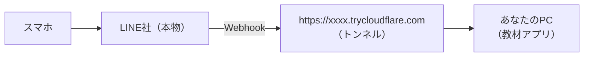

# B3 Webhook で自分のPCの bot とつなぐ

> コースA 第3章③・第5章・第6章・第7章 の本物版です。

ここからは、本物のLINEから **あなたのPCで動いている教材アプリ** に Webhook を届けます。PCはインターネットから直接は見えないので、**トンネル**（Cloudflare Quick Tunnel）で一時的な入口を作ります。



## 1. トンネルつきで起動する

教材アプリを止めてから、次のコマンドで起動します。

```bash
docker compose --profile tunnel up
```

ログの中に `https://○○○○.trycloudflare.com` というURLが出ます。これが **公開URL** です。

> ⚠ **公開URLは、起動し直すたびに変わります。** 変わったら、Webhook URL（この章）と LIFF のエンドポイントURL（B5）を登録し直してください。体験中はターミナルを閉じずに、起動したままにしておきましょう。

## 2. Messaging API を有効にする

1. Manager → **設定 → Messaging API** →「**Messaging APIを利用する**」
2. プロバイダーは「**新規プロバイダーを作成**」で、自分用の名前（例：`山田の体験プロバイダー`）
   - **会社の名前が付いたプロバイダーが出てきても、選ばない**
3. プライバシーポリシー・利用規約は空欄でOK → 有効化
4. <https://developers.line.biz/console/> を開き、同じアカウントでログイン → 自分のプロバイダー → できたチャネルを開く

## 3. 教材アプリに店舗を作り、値を入れる

1. 教材アプリの [店舗管理](http://localhost:3000/admin/stores) 下の「管理画面から店舗を追加する（コースB用）」で、店名と slug（例 `yamada-real`）を入れて作成
2. **編集** →「LINE 連携設定」に入れる（LIFF ID は B5 で入れるので空でOK）

   | 入力欄 | 取る場所（本物の Developers Console） |
   |---|---|
   | Messaging API チャネルID | チャネル基本設定（Basic settings）の Channel ID |
   | チャネルシークレット | チャネル基本設定の Channel secret |
   | アクセストークン（長期） | Messaging API設定 の一番下「チャネルアクセストークン（長期）」→ **発行** |
   | LINE公式アカウントID | Messaging API設定 の「ボット情報」にあるベーシックID（@xxx） |

3. **更新** → **設定整合性をチェック**（LIFF ID 以外がOKならよい。本物の LINE に問い合わせています）

## 4. Webhook を登録する

1. 編集画面の「LINE 連携 確認 / テスト」に **公開用 Webhook URL** が出ています（`https://○○.trycloudflare.com/api/webhook/line/store/{slug}`）。コピーする
   - 出ていないときは、トンネルが起動しているか確認（`docker compose --profile tunnel up` で起動したか）
2. Developers Console → **Messaging API設定** → **Webhook URL** に貼って保存（更新）
3. **検証（Verify）** → **成功** が出ればOK
4. **Webhookの利用** を **オン**
5. 同じページの「応答メッセージ」の **編集** から Manager の応答設定を開き、**応答メッセージをオフ** にする

## 5. 話しかける

スマホから、自分の公式アカウントに話しかけます。

| 送る言葉 | 返事 |
|---|---|
| 何を送っても | 「ギフトはこちらから贈れます 🎁」＋贈る画面のリンク（管理画面の「ギフト誘導を自動返信する」がオンのとき） |

[裏側ビュー](http://localhost:3000/inside) を見ると、**本物のLINE社から届いたWebhook** が記録されています（「LINE社（疑似）」の行はありません。LINE社の中は見えないからです）。

## 6. bot の返事を変えてみる（課題）

[app/Services/Bots/StoreBot.php](../../app/Services/Bots/StoreBot.php) を開いて、次の要件を実装してください。保存すればすぐ反映されます（PHP は再起動不要）。

| レベル | 要件 |
|---|---|
| B3-1 | `営業時間` と送られたら「11:00〜22:00 です」と返す（B1 で Manager に作ったキーワード応答を、プログラムで作る）。それ以外は今までどおりギフトのリンク |
| B3-2 | `メニュー` と送られたら、そのお店の販売中の商品と値段の一覧を返す（ヒント：`$store->menus()->where('is_active', true)->get()`） |
| B3-3 | 友だち追加されたとき、その人の **名前を呼んで** あいさつする（ヒント：`$line->profile($event['source']['userId'])` の答えの `data['displayName']`） |

## うまくいかないとき

| 症状 | 見るところ |
|---|---|
| 検証（Verify）が失敗する | 公開URLが最新か（起動し直すと変わる）・slug が合っているか・教材アプリが動いているか |
| 裏側ビューに「署名が合いません」 | 管理画面のチャネルシークレット（Messaging API チャネルの値か） |
| 裏側ビューに「LINEにお願い … → 401」 | アクセストークン（再発行したら入れ直す） |
| 返事が2通来る | 応答メッセージがオンのまま |
| 署名もOKなのに返事がない | 管理画面の「テキスト受信時にギフト誘導を自動返信する」がオフ |
| 何も起きない（裏側ビューに何も出ない） | Webhookの利用がオンか・応答設定が「チャット」になっていないか |

## 提出

- スマホで bot が返事をしている画面（B3-1〜3 のどこまでできたか）
- `git diff > kadaiB3.txt`
