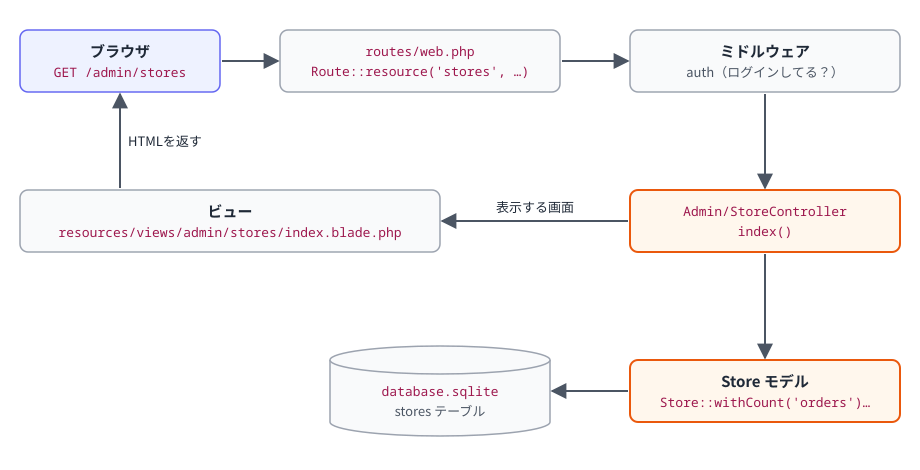

# C0 Laravel の地図

## 1つの画面ができるまで

ブラウザで <http://localhost:3000/admin/stores> を開いたとき：



| 役割 | 場所 | ひとことで |
|---|---|---|
| ルート | `routes/web.php` / `routes/api.php` | どのURLを、どのコントローラーのどの関数に任せるか |
| ミドルウェア | `app/Http/Middleware/`、`bootstrap/app.php` | コントローラーの前に必ず通る関所（ログイン確認、LINEユーザーの特定） |
| コントローラー | `app/Http/Controllers/` | 入力を受け取り、モデルを使い、画面を返す |
| モデル | `app/Models/` | テーブル1つにつき1つ。データの読み書きと、関係（hasMany など） |
| サービス | `app/Services/` | 画面に関係ない「業務のルール」（注文の状態、手数料、LINEへの送信） |
| ビュー | `resources/views/` | 画面の HTML（Blade）。`{{ }}` で値を表示（自動でエスケープ） |
| マイグレーション | `database/migrations/` | テーブルの設計図 |

## 確かめる

```bash
# URL の一覧（どのコントローラーが担当しているか）
docker compose exec app php artisan route:list --path=admin/stores

# データを対話的にさわる（tinker）
docker compose exec app php artisan tinker
```

tinker の中で：

```php
App\Models\Store::count();
App\Models\Store::where('slug', 'nocturne')->first()->menus;      // バー ノクターンの商品
App\Models\Order::latest('id')->first()->status->label();            // 最新の注文の状態
App\Models\Mock\OfficialAccount::pluck('name');                      // 疑似LINE側（別のDB）
```

`exit` で抜けます。

## 課題

| レベル | 内容 |
|---|---|
| C0-1 | 店舗一覧（管理画面）に「商品数」の列を足す。ヒント：コントローラーで `withCount('menus')`、ビューで `$s->menus_count` |
| C0-2 | `routes/web.php` を読んで、「お客さんが贈る画面」「オーナーが受け取るボタン」「Webhook の受け口」がどのコントローラーのどの関数か、表にまとめる |
| C0-3 | 疑似スマホで1回ギフトを贈り、裏側ビューのそれぞれの行が、どのファイルの何行目で記録されているかを探す（ヒント：`Inside::ok` で検索） |
